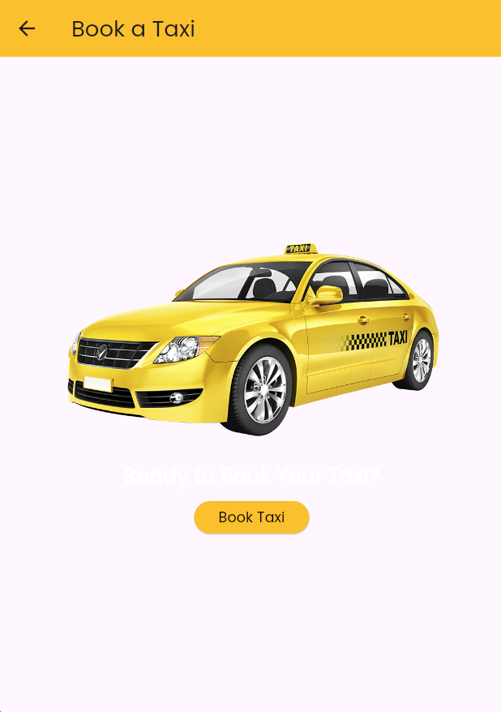
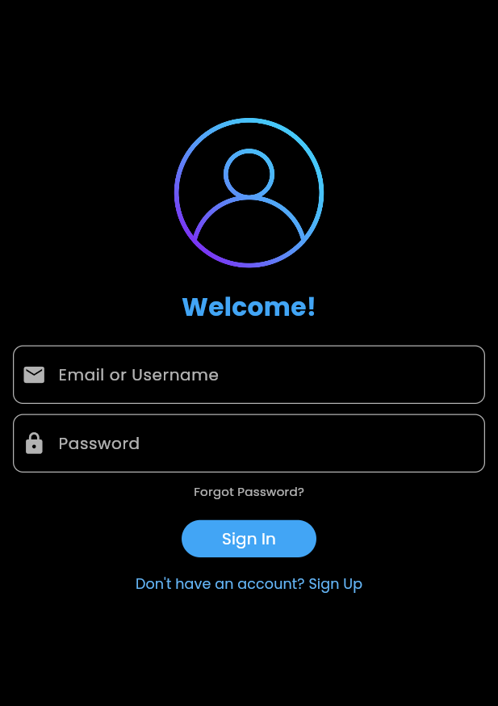
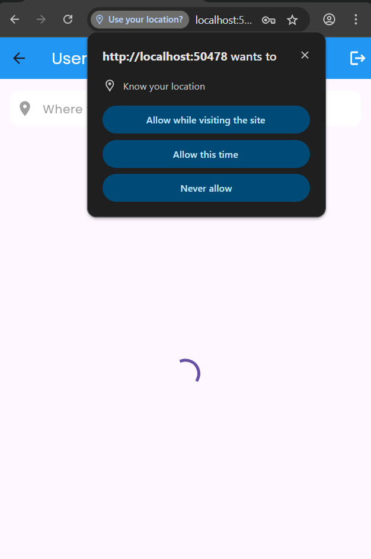
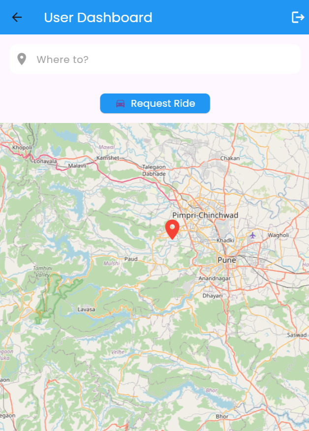
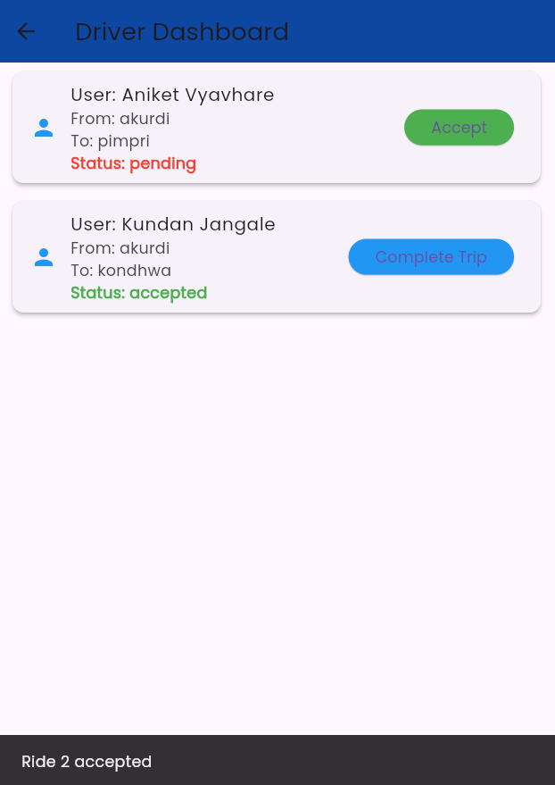

<h1 align="center">🚗 SharedGo - Blockchain-based Ride Sharing App</h1>

  
  
  

---

## 📱 Overview

SharedGo is a decentralized ride-sharing Flutter application that leverages blockchain to ensure transparent, secure, and tamper-proof trip records. It's designed to solve the trust issues in current ride-sharing systems using smart contracts and immutable data.

---

## ✨ Features

- 🔒 Blockchain-based trip verification  
- 👤 Rider & Driver login with role-based flow  
- 🧾 Transparent trip history  
- 📍 Ride creation & booking  
- 📦 Firebase for authentication and storage  
- 🌐 Clean UI with Flutter  

---

## 🛠 Tech Stack

| Tech                  | Usage                              |
|-----------------------|-------------------------------------|
| 🧱 Flutter            | Cross-platform app UI              |
| 🧠 Dart               | Core application logic             |
| 🔗 Blockchain (Planned) | Trip recording with smart contracts |
| 🔥 Firebase           | Authentication & Firestore        |
| 📍 Google Maps API    | Route tracking (upcoming)          |

---

## 📸 Screenshots

| Home Screen | Booking Page |
|-------------|--------------|
|  |  |

| Driver Login | User Login | Sign Up |
|--------------|------------|---------|
|  |  |  |

| User Dashboard | Driver Dashboard | Ride Page |
|----------------|------------------|-----------|
|  |  |  |

| Distance & Fare | Request Ride | User Requests |
|------------------|---------------|----------------|
|  |  |  |

| Launcher Icon |
|----------------|
|  |

---

## 📄 License

This project is licensed under the [MIT License](LICENSE).

Let me know if you want to contribute or need help setting up!
